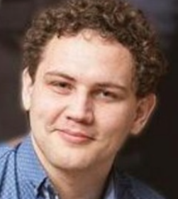

# Dzmitry Samasiuk 

🖁 Cell: +375292201393

📩 E-mail: imsweet75@gmail.com

📫 Place: Minsk, Belarus.

🔗 LinkedIn: https://www.linkedin.com/in/dimitrisamosiuk

💻 GitHub page: https://github.com/oxygasa?tab=repositories 

🎲 Discord > RS School: Dzmitry_Samasiuk(@oxygasa)

## **Java script frontend developer**

### Summary of qualification:
* I know UX standards for mobile interfaces (Android, iOS, Win Mobile, Blackberry), Desktop (Windows 95 - 11, Linux Debian distributions with Gnome and KDE), browsers (based on V8, Gecko, IE).
* I can read SOAP, REST schemes, I know OSI, TCP IP network models and how requests/responses are sent and received, how a person who knows programming can get into source codes, query a database.
* As AQA in the past I wrote Selenium (GUI tests), Selenide, Rest Assured (API) and Unit tests to help developers with TestNG, Junit in Java (my first language).
* My code i in acceptance with clean code (KISS, DRY...), Builder, Factory patterns.
* I can hang on with CI/CD via Jenkins, GitHub Actions.

### Soft skills:
* Diligent, can work until night without burnout.
* Polite with people, helpful, I don't create conflicts, and I know how to extinguish and make amends for those that do appear.
* Responsibly appear a few tens of minutes before scheduled meetings.
* I have confidence that I can achieve results with quality work. For myself, I set the goal of only a horizontal increase (growth as a specialist), as the most realistic and achievable.

### Language knowledge levels: 
* English (B2 - Upper-intermediate)
* Polish (B2 - Upper-intermediate)
* Russian, Belarussian (Native speaker)

### Education

*July - Jan 2022 “Step” Computer Academy, Minsk, Belarus.*

Manual and Automation testing. 

*2016 State Technical University, Brest, Belarus*

Economist. Bachelor. Department of Management, Economics and Finance.

*2012 College of Business and Law, Brest, Belarus.*

Accountant, Specialist. Department of Accounting, Analysis and 	Control.

### Professional experience

*Banking software maintenance (production) (Alfa-bank CJS)*

*Oct 2022 till now*

Server side bank maintenance for an operation day. Detect and correct runtime defects. Investigation bank employees' incidents through intervention in the backend. Interaction with development departments. Implementation testing. End of day work.

*Testing Automation Engineer (Intership) (Epam Systems)*

*Feb 2022 - Jun 2022*

Testing theory exams about the manual and automation testing (Technical interview series in russian and english langs). Testing exercise tasks (homeworks). Mentoring pet-project: https://github.com/oxygasa/trello_testing_project 

Recruiting has been stopped.

*QA Engineer - Self-employed (Freelance)*

*Feb 2020 - Feb 2022*

I was a self employed tester on special web platforms for testing. Platforms which I used:
* Turkcell/Life:) - a series of test cycles for a messenger BIP. Made a test strategy in a team, created a Test result report with metrics.
* Chase Bank - tested the bank's database and related applications. Due to NDA, I cannot disclose all the information.
* O'Reilly - retail auto parts stores in the United States. Load testing with JMeter. API and GUI tests. Checking synchronization with local stores.
* CBS - Testing a service for US TV. Ad-hoc testing in the beginning. After repeating the invites to the test cycles I created a test documentation with test design techniques. 
* Trello - web service with notes in kanban board style. API and GUI autotest series.
* Kinemaster - a video editing app for smartphones. Took a part in a group creating the test plan in the beginning. The project was small, so I did exhaustive testing by the crew's opinion. 
* Yahoo Mail - an email service. The customer was interested in automation testing. I wrote a UI in Webdriver Selenium with Page objects pattern, then we linked it with Jenkins. 
* Deep Instinct - Performance testing of a stand alone PC app which works background. A basic moment was in log collecting for PCs (a dump files) and on smartphones (via ADB). 
* Fieldwire - Build project software. A partifically made project. We tested the API via Postman. When UI appeared, then via Fiddler and Charles intercepted traffic and watched how the API interacted with the UI part. 
* Pokerstar - a web page for poker and casino gambling. A functional testing with pen-testing elements. We collected vulnerabilities, tried writing templates of SQL and XSS injections.
* Playtika - mobile free to play games, manual testing. A part has been automated using Appium.
* LibreOffice - volunteering for free to support open source MS Office competitor. Support by sending regular reports.

*Calculating department manager in the store (Eurotorg LLC)*

*Feb 2016 - Oct 2022*

* My beginning was as the 4 lvl cashier. The service was carried out in three languages (RUS, BY, ENG).
* Then I grew to a 6 lvl cashier’s position and helped the senior cashiers.
* Then I became a senior cashier.
* Last time I was a calculating department manager. I managed the group of senior cashiers, I am in charge of the department, do the reports and hand over the proceeds. I was an intermediary between the store and the accounting department.

*Accountant (bookkeeper)*

*Jun 2012 - Feb 2016*

* Inco-food LLC 2012 - Stating position of accounting. For free 1 month of practice.
* Bravo LLC 2012 - Acoountant without a contract Job scopes: services selling.
* Imperia ForBe LLC 2012 - Accounting as 1 accountant in HOA.
* Brest service OJSC 2013 - Economist in the shop. Job scopes: retail goods manipulations.
* Lexim JV 2014 - Accountant. Count of accountants was above 2 people. Job scopes: all exact head accountant scopes.
* Brest electromechanical plant OJSC - Accountant. Job scopes: warehouses, sales, courts, debts, business expenses, financial results.